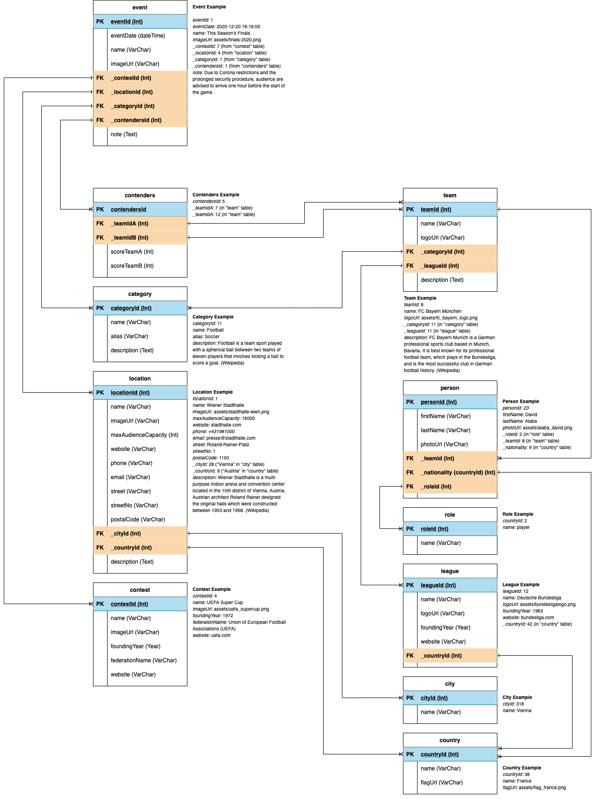

# Event Radar

EventRadar is a calendar of sports events. Events can be created, edited and categorized based on their sports. This is an exercise project for a job application at Sportradar.

The webapp is available publically at https://eventradar-app.herokuapp.com/

## Initial Requirements

### 1. Coding Exercise
Goal is to implement a calendar for sport events. Events may be added to the calendar and it should be possible to categorize the events based on sports.

#### Examples:
- Sat., 18.07.2019, 18:30, Football, Salzburg – Sturm
- Sun., 23.10.2019, 09:45, Ice Hockey, KAC - Capitals

### 2. Task 1 - Modelling
Start with identifying the database entities and then create a suitable database diagram (ERD). The ERD should cover all tables and their relations.
Furthermore the database should contain additional information, which may be valuable for Sport Calendar.

### 3. Task 2 – DB Structure/Data
Create a database following the structure of your ERD. Add all necessary fields to the tables. Foreign keys should be named with a ‘_’ as prefix (Example: _FOREIGNKEY).

### 4. Task 3 – HTML/PHP
Create a HTML frontend to display the data in a user friendly way. Navigation should be indicated but no functionality is needed.
Then go on with the PHP part for dynamic display of data – avoid SQL queries within loops!

#### Required parts:
- Database connection
- SQL query
- Data output

Additional filters can be added to the calendar presentation.

## Installation
This application uses PHP Symfony, MySQL and XAMPP.

Clone the repository and import the DB export from the directory `db-export` into your MySQL database. Set the database path and user credentials in `.env`.

Run `composer install` (an additional `composer update` might be necessary).

To launch the webshop run `php bin/console server:run` and then follow the instructions in the terminal.

### User Accounts
You can register a new user or use the following existing user account:
- `user@gmail.com` for a regular user. The account password is `123123`

## Concept and Implementation
This section describes the steps from the concept to the final implementation of __EventRadar__.

### Database Model
The following database model was constructed based on the requirements

